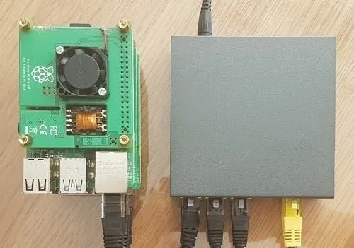
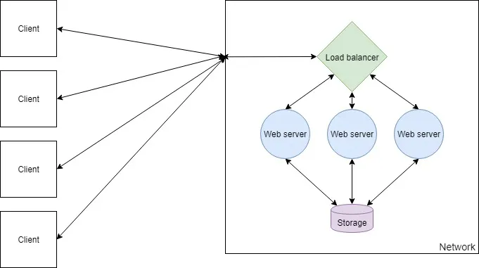
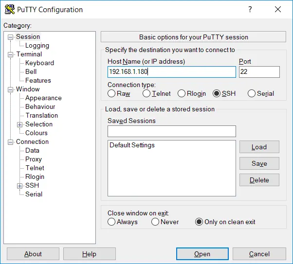
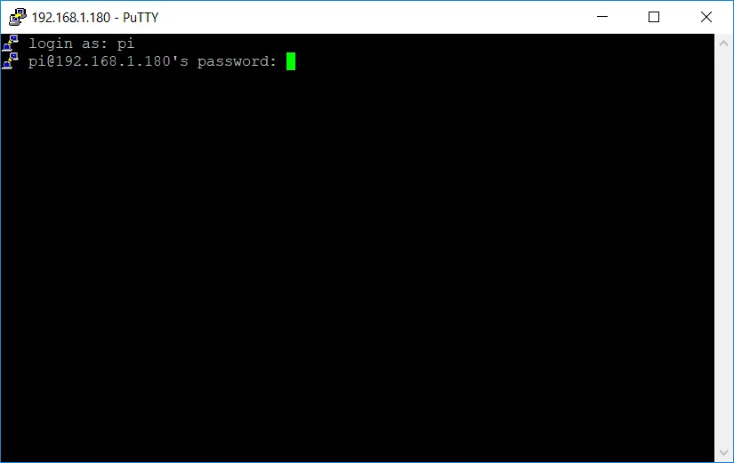
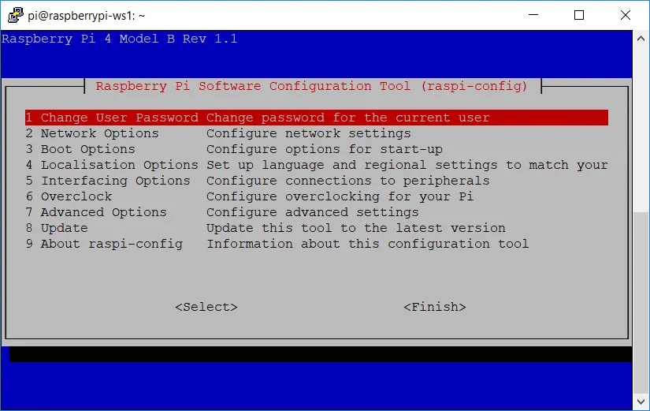

> [!WARNING]
> This article was originally published in 2019. As a result, versions of software that are referenced, as well as information about ARM support that is written in this article, is largely outdated.



## Table of Contents

## Components of a Web Farm

A web farm is a configuration of two or more servers running on a network to serve the same web application. Incoming web requests are routed to a load balancer, which forwards each request to one of the servers serving the web application.



The benefit of this approach is that adding more nodes to the network is trivial, and therefore the request-handling capacity of the network can be scaled appropriately. It also allows you to update the application without taking it offline, as each node can be individually upgraded.

In this article, I will explain how to set up and deploy an ASP.NET Core application on a web farm. To do this, I will use Nginx as the load balancer and Kestrel as the web server. This setup is extremely lightweight and performant, and both pieces of software are cross-platform, meaning this guide applies to macOS, Linux, and Windows. You can swap out components wherever you wish — for example, you could replicate this setup with a Node or Flask app.

Before starting, you should have a basic understanding of Linux, Git, and Docker. You'll also need a web application ready to deploy.

## Choosing Hardware

### Raspberry Pi Boards

As per the definition of a web farm, we are going to be needing a minimum of two computers available for running our web application. Depending on how heavy a web application you want to run and your budget will depend on what model(s) of Raspberry Pi you require. When writing this article, I tested the setup on a cluster of Raspberry Pi model 4B.

For the most part, you will not need a lot of RAM to run a web application, unless you are heavily utilising caching. CPU power is a factor when it comes to how quickly you want a request to be handled, so generally a CPU with a higher clock speed is better. More cores will allow more concurrent requests and so more traffic at one time.

### Storage

For storage, each Raspberry Pi will need a micro SD card to store the OS and its files. Storage capacity required depends on whether your web application will store data and what type of data it will store. Generally you will want to isolate your persisted storage away from your web farm nodes, so for your nodes you will want cheap, low capacity cards.

### Networking

A web farm would prefer to run on ethernet than on WiFi as the network will be one of the biggest factors when it comes to speed. It is possible to run a web farm on WiFi and performance certainly won't be terrible, however a wired connection will always be faster. Therefore to run several nodes you should have an ethernet switch and cables.

### Power

Several ways exist to supply power to Raspberry Pi boards but by far the most convenient when using ethernet is to use PoE (power over ethernet). This can be achieved with a [PoE HAT](https://www.raspberrypi.org/products/poe-hat/), although do note that you will need an ethernet switch that explicitly supports PoE.

### The Hardware Setup

Here is the hardware used in this guide, totalling around £210 (or as cheap as £150 with only 2 Raspberry Pi boards):

- 3× Raspberry Pi 4B, 1GB RAM (£105)
- 3× 16GB Micro SD (£15)
- 3× PoE HAT (£54)
- 5-port PoE ethernet switch (£30)
- Ethernet cables (£3)
- 2.5mm standoffs (£10)

## Preparing the Raspberry Pis

### Operating System Setup

> [!NOTE]
> Raspbian was rebranded to Raspberry Pi OS in May 2020.

First, flash the operating system onto each SD card. Use [Raspbian Lite](https://www.raspberrypi.org/downloads/raspbian/), which can be written to the card easily using [Etcher](https://www.balena.io/etcher/). Insert your SD card into a PC, run Etcher, select your downloaded OS image and select the drive. The process shouldn't take more than a minute.

Once your card is flashed, create an empty file named `SSH` on the root of the drive. This enables SSH access so you can remotely connect to the Raspberry Pi.

```powershell
New-Item $drive/SSH -type file
```

The next step is to assemble the hardware: attach the PoE HATs to the boards, insert the SD cards, connect the PoE HATs to the ethernet switch, and connect the ethernet switch to your router. Spacers can be used to stack the boards neatly.

### Securing Each Device

To connect to a Raspberry Pi you will need its local IP address and an SSH client such as [PuTTY](https://www.putty.org/). Find the IP address via your router dashboard and connect via SSH on port 22.



The default credentials for Raspbian are `pi` as the username and `raspberry` as the password.



Once connected, run `sudo raspi-config` to change the password, set a hostname, and access other useful configuration settings.



Then update all software on the Raspberry Pi.

```bash
sudo apt update
sudo apt upgrade
```

### Installing Docker

Docker makes deploying your application straightforward. Raspberry Pi boards have ARM processors, so every image needs to be built from a base image that supports ARM/AArch — but support is rapidly increasing.

Run this command to install Docker:

```bash
curl -sSL https://get.docker.com/ | sh
```

Then add your user to the docker group so you can run Docker commands without `sudo`:

```bash
sudo usermod -aG docker $USER
```

Verify the installation with `docker info`. Repeat this on each Raspberry Pi board.

### Installing Docker Compose

> [!WARNING]
> Docker Compose V1 (installed via pip) is no longer valid; use the Docker Compose V2 plugin (`docker compose`) which is included with modern Docker installations.

Docker Compose is useful for configuring containers per device. The official image does not support ARM, so install it via pip instead:

```bash
sudo apt update
sudo apt install -y python python-pip libffi-dev python-backports.ssl-match-hostname
sudo pip install docker-compose
```

### Installing Git

Git can be used to easily pull configuration files on to each device.

```bash
sudo apt-get install git
```

## Persisting Data

### Choosing a Storage Mechanism

If your web application requires persisted storage (i.e. it does more than serve static files), you will want to run some form of storage server accessible across the local network — a SQL/NoSQL server or NAS storage, depending on your needs.

Due to limited ARM support, both MySQL and PostgreSQL can bring up issues when using an ORM such as Entity Framework. A good alternative is MariaDB, which has a well-documented image maintained by the [LinuxServer community](https://hub.docker.com/r/linuxserver/mariadb/) with good Entity Framework support. MongoDB, Redis, and Cassandra also support ARM and have Docker images available.

### Running MariaDB with Docker

Create the following Docker Compose file and commit it to a Git repo so you can clone it onto your Raspberry Pi:

```yaml file="docker-compose.yml"
version: "3"
services:
  mysqldb:
    image: linuxserver/mariadb
    container_name: mariadb
    environment:
      - PUID=1000
      - PGID=1000
      - TZ=Europe/London
      - MYSQL_ROOT_PASSWORD=RootPassword
      - MYSQL_DATABASE=DatabaseName
      - MYSQL_USER=DatabaseUser
      - MYSQL_PASSWORD=DatabaseUserPassword
    ports:
      - 3306:3306
    restart: unless-stopped
```

The `ports` configuration maps port 3306 on the Raspberry Pi to port 3306 inside the container. Set the `TZ` variable to your local time zone, and update the database credentials accordingly.

Set the connection string in your web application to match:

```
Server=192.168.1.180;Port=3306;Database=DatabaseName;Uid=DatabaseUser;Pwd=DatabaseUserPassword;SslMode=Preferred;
```

Clone the Docker Compose file onto your Raspberry Pi and run `docker-compose up` to create and start the container.

## Setting up a Load Balancer

### LetsEncrypt + Nginx

> [!NOTE]
> The `linuxserver/letsencrypt` image was rebranded to `linuxserver/swag` in August 2020.

SSL certificate generation can be automated by Certbot. Since the official Certbot image doesn't support ARM, use the [LinuxServer LetsEncrypt image](https://hub.docker.com/r/linuxserver/letsencrypt/), which bundles Nginx and Certbot together.

```yaml file="docker-compose.yml"
version: "3"
services:
  letsencrypt:
    image: linuxserver/letsencrypt
    container_name: nginx
    cap_add:
      - NET_ADMIN
    environment:
      - PUID=1000
      - PGID=1000
      - TZ=Europe/London
      - URL=yourdomain.com
      - SUBDOMAINS=www
      - VALIDATION=http
      - EMAIL=your@emailaddress.com
      - STAGING=false
    volumes:
      - ./yourdomainname.conf:/config/nginx/site-confs/yourdomainname.conf
      - ./nginx.conf:/config/nginx/nginx.conf
    ports:
      - 80:80
      - 443:443
    restart: unless-stopped
```

The `URL` and `SUBDOMAINS` variables configure the certificate domain. The simplest validation method is HTTP; DNS validation is more comprehensive and supports wildcard certificates.

Nginx configuration is done by mounting `.conf` files into `/config/nginx/site-confs/`. Create `yourdomainname.conf` to define the upstream web servers, redirect HTTP to HTTPS, and proxy traffic:

```nginx file="yourdomainname.conf"
# list web application server IPs
upstream webservers {
  server 192.168.1.210;
  server 192.168.1.220;
}

# redirect all HTTP traffic to HTTPS
server {
  listen 80;
  server_name yourdomainname.com www.yourdomainname.com;
  return 301 https://$host$request_uri;
}

# route traffic to web application servers
server {
  listen 443 ssl;
  server_name yourdomainname.com www.yourdomainname.com;

  add_header X-Frame-Options "SAMEORIGIN";
  add_header X-Content-Type-Options "nosniff";

  location / {
    proxy_pass http://webservers;
    proxy_http_version 1.1;
    proxy_set_header Upgrade $http_upgrade;
    proxy_set_header Connection keep-alive;
    proxy_set_header Host $host;
    proxy_cache_bypass $http_upgrade;
    proxy_set_header X-Forwarded-For $proxy_add_x_forwarded_for;
    proxy_set_header X-Forwarded-Proto $scheme;
  }
}
```

## What's Left?

With the Nginx image running and your web servers up, the web farm is configured. The remaining steps are DNS setup and port forwarding on your router. Most home routers have dynamic IP addresses, so you'll want to configure a dynamic DNS service. Fortunately, the Nginx configuration does not need to change when using dynamic DNS.

